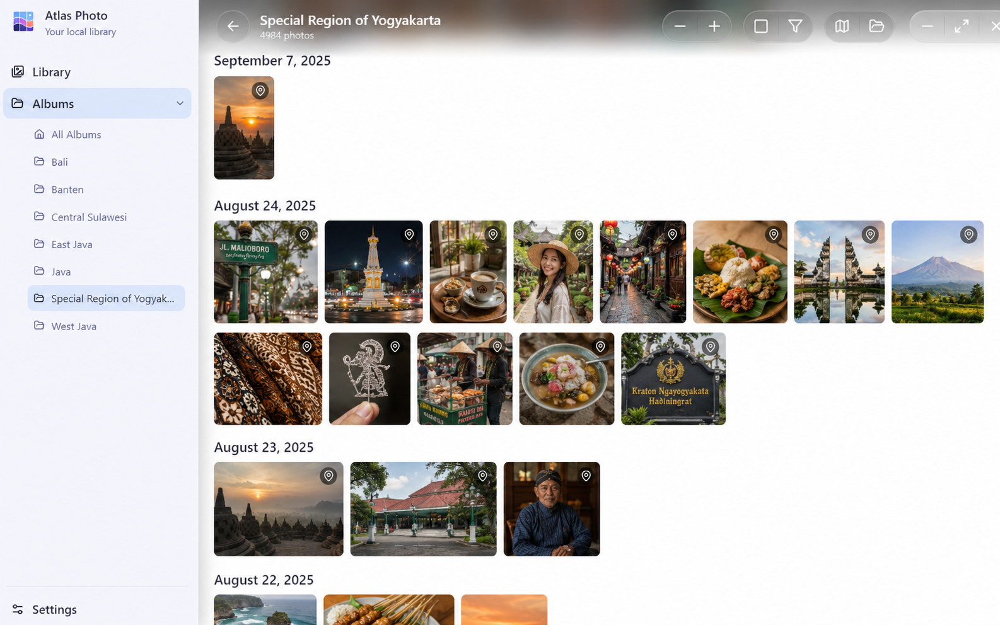
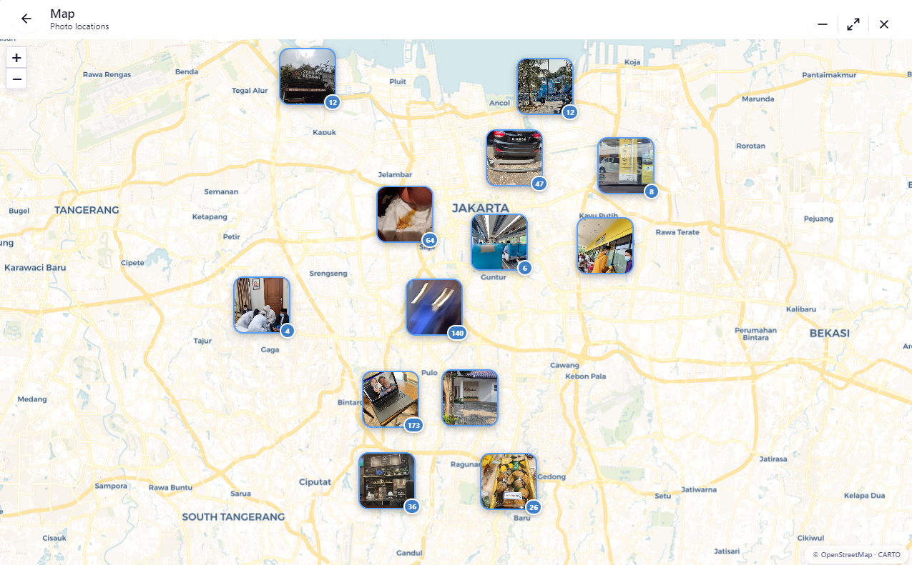

# 🗺️ Atlas Photo

**Atlas Photo** is a premium, privacy-first photo gallery application that seamlessly integrates your photos with an interactive map. It brings your memories to life through beautiful, fluid interfaces and geographic context.

[](https://opensource.org/licenses/MIT)


<p align="center">
  
  
</p>
<p align="center"><small><em>Note: This image was generated by AI; any resemblance to real locations is fictional.</em></small></p>

---

*   📸 **Fluid & Intuitive Gallery:** A beautifully crafted interface designed for seamless photo browsing and discovery.
*   🗺️ **Map View Integration:** Instantly see where each photo was taken on an interactive leaflet map.
*   📍 **Automatic Metadata Extraction:** Automatically pulls GPS coordinates from EXIF data to populate the map.
*   🔒 **Privacy-First & Local-Only:** Your photos never leave your device. Everything is processed 100% locally for maximum security and privacy.
*   🚀 **High Performance:** Built with Electron, React, and Vite for a smooth, responsive experience.

---

## 📥 Downloads

Get the latest version of Atlas Photo below:

| Platform | Type | Download Link |
| :--- | :--- | :--- |
| **Windows** | Installer (`.exe`) | [Download Setup](https://github.com/programmerlapar/atlas-photo/releases/download/v0.1.0/Atlas%20Photo%20Setup%200.1.0.exe) |
| **Windows** | Portable (`.exe`) | [Download Portable](https://github.com/programmerlapar/atlas-photo/releases/download/v0.1.0/Atlas%20Photo%200.1.0.exe) |

> *Note: Links above are placeholders. Please visit our [Releases Page](https://github.com/programmerlapar/atlas-photo/releases) to download the latest version.*

---

## 🛠️ Technical Deep Dive

Atlas Photo is built with a modern, robust tech stack:

*   **Frontend:** React 18 + Tailwind CSS v4 (for beautiful styling)
*   **Desktop Framework:** Electron (for cross-platform capability)
*   **Build Engine:** Vite (for lightning-fast development and bundling)
*   **Map Rendering:** Leaflet (highly performant interactive maps)
*   **Metadata Parsing:** `exifr` (specialized EXIF data handling)
*   **Image Processing:** `sharp` (high-speed image manipulation)
*   **State Management:** Zustand (orchestrated global state)

---

## 💻 Getting Started (For Developers)

If you want to explore the codebase or contribute, follow these steps.

### Prerequisites

*   [Node.js](https://nodejs.org/) (v18+)
*   [Yarn](https://yarnpkg.com/)

### Setup & Installation

1.  **Clone the repository:**
    ```bash
    git clone https://github.com/programmerlapar/atlas-photo.git
    cd atlas-photo
    ```

2.  **Install dependencies:**
    ```bash
    yarn install
    ```

3.  **Run in development mode:**
    ```bash
    yarn electron:dev
    ```

### Building for Production

To generate production-ready binaries:

```bash
yarn electron:build
```

---
## ☕ Support the Project

If you find Atlas Photo useful, consider supporting its development!
[Buy me a coffee via PayPal](https://paypal.me/programmerlapar)

---
